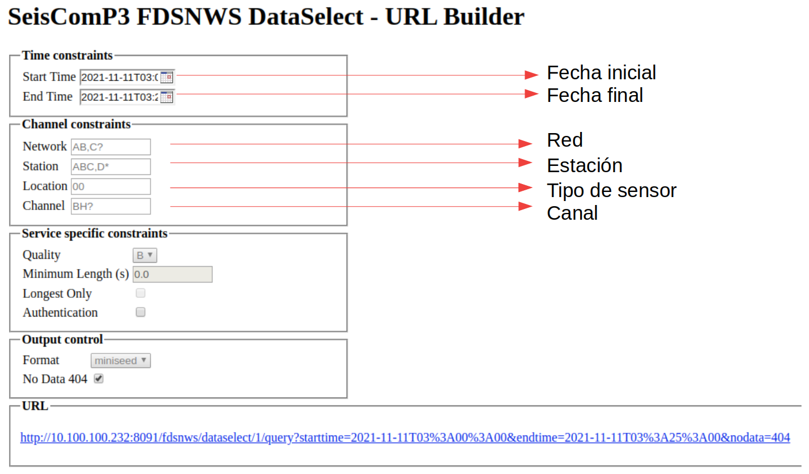
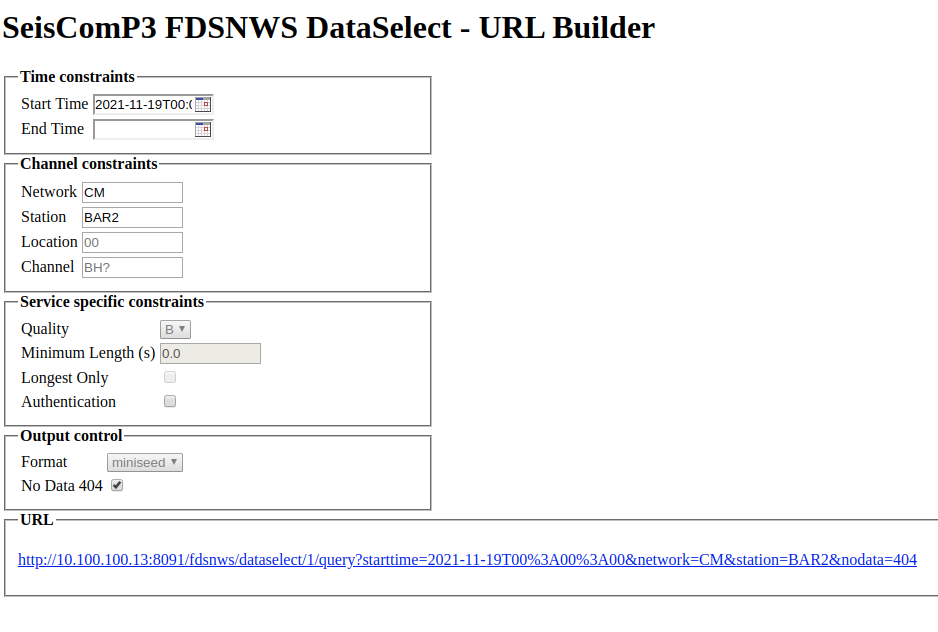
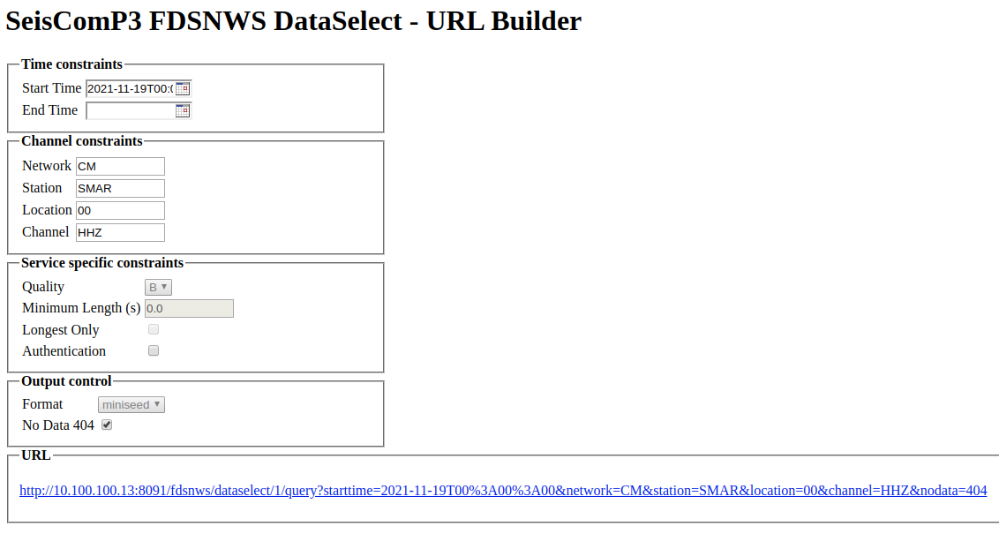

<!-- .element width="700"-->

# Rutina extracción

## Descripción
Script que permite realizar extracciones del servido de seiscomp mediante el servicio web fdsn

**SI ESTA EN EL PROC4 NO ES NECESARIA LA SECCION DE INSTALACIÓN**

Python version 3.7 
```bash
sudo apt-get install python3.7 
```
Instalar virtualenv
```bash
python3.7 -m pip install virtualenv
```

### Crear ambiente virtual con virtualenv

```bash
python3.7 -m virtualenv .venv
source .venv/bin/activate
pip install -r requirements.txt
```

## Iniciar *scx2.py*

###Parámetros de entrada

La rutina *scx2.py* necesita los siguientes parámetros de entrada:

/begin{itemize}
    /item YYYY: año
    /item MM: mes
    /item DD: día
    /item HHMMSS: hora [UTC]
    /item tt: ventada de tiempo hacia adelante en segundos [s]
    /item NET: red
    /item STA: estación
    /item LOC: localización
    /item CHA: canal

end{itemize}

#### Parámetros obligatorios

Dentro de los parámetros de entrada se encuentran unos que son obligatorios para el buen funcionamiento de la rutina: [YYYY, MM, DD, HHMMSS, tt]. En caso de faltar o digitar erróneamente alguno de estos, *scx2.py* no se ejecutará.

##### Parámetros opcionales

Dentro de los parámetros de entrada se encuentran unos que son opcionales, de los cuales ninguno de estos depende el funcionamiento de la rutina: [NET, STA, LOC, CHA].

### Ejecución

Para ejecutar la rutina en la terminal, los parámetros de entrada deben estar dispuestos de la siguiente forma:

```
pyhton scx2.py YYYY MM DD HHMMSS tt NET STA LOC CHA
```

En caso de tener el alias *extraccion* incluído en su *.bashrc* (*alias extraccion="source /opt/rutinas/.obspy-venv/bin/activate; python /opt/rutinas/Extraccion/scx2.py"*), el comando a ejecutar es:

```
extraccion YYYY MM DD HHMMSS tt NET STA LOC CHA
```

#### Algunos ejemplos

- Extracción de CM.BAR2.00.HH* desde 2021-11-09T04:30:00 UTC a 2021-11-09T05:30:00 UTC:

```
extraccion 2021 11 09 043000 3600 CM BAR2 00 HH*
```

- Extracción de CM.BAR2.00.* desde 2021-11-09T04:30:00 UTC a 2021-11-09T05:30:00 UTC (de todos los canales):

```
extraccion 2021 11 09 043000 3600 CM BAR2 00
```

- Extracción de CM.BAR2.*.* desde 2021-11-09T04:30:00 UTC a 2021-11-09T05:30:00 UTC (de todos los códigos de localización y canales):

```
extraccion 2021 11 09 043000 3600 CM BAR2
```

- Extracción de CM.*.*.* desde 2021-11-09T04:30:00 UTC a 2021-11-09T05:30:00 UTC (de todas las estaciones de la red, los códigos de localización y canales):

```
extraccion 2021 11 09 043000 3600 CM
```

- Extracción de *.*.*.* desde 2021-11-09T04:30:00 UTC a 2021-11-09T05:30:00 UTC (de todas las redes disponibles, estaciones de cada red, los códigos de localización y canales):

```
extraccion 2021 11 09 043000 3600
```

## Servicio web FDSN

La Federaciòn Internacional de Redes Sismologicas (FDSN) es un conjunto de organizaciones que colaboran con el fin de compartir informacion sismologica mundial de alta calidad atraves de sus servicios web y con estandares al momento de almacenar y manejar la informaciòn que permita  el avance cientifico en el campo de la sismologia, el SGC hace parte de esta iniciativa razon por la cual dispone del servicio web fdsnw para cada uno de sus servidores.


Aunque existen varios servicios que se realizan atraves de fdsnws en este caso nos centraremos en el servicio dataselect a traves del cual se realizan las descargas de formas de onda en formato mseed segun los parametros que se selecciones, los links para acceder a este servicio en los diferentes servidores son los siguientes:

- Servidor 232:
 
```
http://10.100.100.232:8091/fdsnws/dataselect/1/builder
```
- Servidor 222:
 
```
http://10.100.100.222:8091/fdsnws/dataselect/1/builder
```
- Servidor 13:
 
```
http://10.100.100.13:8091/fdsnws/dataselect/1/builder
```
- Servidor 50 (pruebas):
 
```
http://10.100.100.50:8091/fdsnws/dataselect/1/builder
```
### Construcciòn de consultas:



La imagen anterior muestra los parametros modificables en el servicio web, una vez seleccionados los parametros para la consulta el link de color azul de la parte inferior descargara los datos que busquemos en formado *miniSEED*


#### Parámetros obligatorios

Los parametros obligatorios son solamente fecha inicial y fecha final, deben ser entregados en el siguiente formato :

[YYYY-MM-DDTHHMMSS]

##### Parámetros opcionales

Dentro de los parametros opcionales se encuentra el resto señalados en la imagen anterior con flechas de color rojo, estos son [ Red, Estacion, Tipo de sensor y canal]

Cuando estos paramentos opcionales sean dejados en blanco el servicio buscara todas las opciones posibles, es decir si dejarmos sin informacion la red buscara todas las estaciones de todas las redes disponibles, al igual que si no marcamos el tipo de estacion buscara todos los sensores.

#### Algunos ejemplos

A continuacion veremos algunos ejemplos de consultas realizadas en el servicio web.

- CONSULTA 1 : 



Esta consulta descargar las formas de onda de todos los sensores presentes en la estacion BAR2 entre la fecha inical y la fecha final.

- CONSULTA 2:



Esta consulta descargar las formas de onda de la estacion con codigo *CM*, la estacion se llama *SMAR* y el sensor es el *00* en la componente *HHZ* entre la fecha inical y la fecha final.


## Resultados

La rutina *scx2.py* y el servicio web *fdsnws* generará un archivo *miniSEED* el cual se utiliza para datos de series de tiempo. El módulo *scrttv* resulta una opción para visualizar la traza extraída: 

```
scrttv archivo_generado.mseed
```

#

>Nelson David Perez

>>nperez@sgc.gov.co